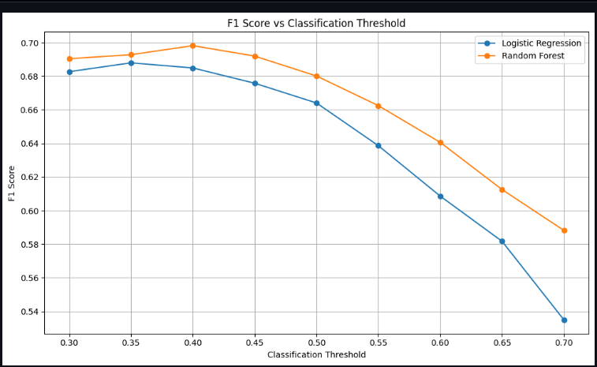

# Random Forest vs Logistic Regression: A Reproducibility and Threshold-Sensitivity Study

A focused reproduction and extension inspired by:

> Couronné, R., Probst, P., & Boulesteix, A.-L. (2018).  
> *Random forest versus logistic regression: a large-scale benchmark experiment.*  
> BMC Bioinformatics, 19, 270.

This project compares **Logistic Regression** and **Random Forest** on the **UCI Adult Income dataset**, with an additional investigation into how the **classification threshold affects model performance**.

The goal is to reproduce the core idea of comparing these two widely used classification approaches while extending the experiment with a controlled threshold-sensitivity analysis.

> **Important:** This is a focused reproduction/extension, not a full reproduction of the original paper. The original study evaluated 243 real-world datasets, whereas this project evaluates one dataset in depth. The methodological differences are documented in the Limitations section.

---

## 📌 Research Questions

This project investigates four questions:

1. Does Random Forest outperform Logistic Regression on the Adult Income dataset?
2. How large is the performance difference between the two models?
3. How sensitive are the models to the classification threshold?
4. Does threshold selection change which model appears preferable?

---

## 📄 Paper Background

Couronné, Probst, and Boulesteix conducted a large-scale benchmark comparing Random Forest and Logistic Regression across **243 real-world binary classification datasets**.

Their study reported that Random Forest achieved better accuracy than Logistic Regression on approximately **69% of the datasets**, with an average accuracy advantage of about 0.029 across the benchmark. :chatgpt-content-reference{index="1"}

Rather than attempting to reproduce the entire benchmark, this project performs a **focused reproduction** on one dataset and adds a threshold-sensitivity experiment.

The purpose is to understand:

- how the two models behave on a specific dataset,
- how close their performance can be,
- and how the choice of classification threshold affects the comparison.

---

# 📊 Dataset

The experiment uses the **UCI Adult Income Dataset**, also known as the Census Income dataset.

The prediction task is to determine whether an individual's annual income exceeds **$50,000** based on census-related attributes. The official UCI dataset contains 14 predictive features and includes both categorical and integer-valued variables. :chatgpt-content-reference{index="2"}

### Dataset used in this experiment

This project uses the `adult.data` portion of the dataset.

| Property | Value |
|---|---:|
| Samples used | 32,561 |
| Predictive features | 14 |
| Numerical features | 6 |
| Categorical features | 8 |
| Target | Income |
| Negative class | `<=50K` |
| Positive class | `>50K` |

### Class distribution

| Income class | Samples | Percentage |
|---|---:|---:|
| `<=50K` | 24,720 | 75.9% |
| `>50K` | 7,841 | 24.1% |

The dataset contains missing values in several categorical variables. These missing values are handled through preprocessing rather than removing the affected observations.

### Dataset source

**UCI Machine Learning Repository — Adult Dataset**

https://archive.ics.uci.edu/dataset/2/adult

---

# 🧪 Methodology

Two classification models were compared.

## 1. Logistic Regression

Logistic Regression was implemented using the following preprocessing pipeline:

- Median imputation for numerical features
- Most-frequent imputation for categorical features
- StandardScaler for numerical features
- One-hot encoding for categorical features
- Logistic Regression classifier

The numerical features were standardized because Logistic Regression is sensitive to feature scale.

---

## 2. Random Forest

Random Forest was implemented using:

- Median imputation for numerical features
- Most-frequent imputation for categorical features
- One-hot encoding for categorical features
- 200 decision trees
- Fixed random seed for reproducibility

Scaling was not applied to the numerical variables because tree-based models do not require feature standardization.

---

# 🔀 Experimental Design

A major goal of the experiment was to avoid using the test set for model-selection decisions.

The dataset was divided into three subsets:

| Split | Percentage | Samples |
|---|---:|---:|
| Training | 64% | 20,839 |
| Validation | 16% | 5,209 |
| Test | 20% | 6,513 |

The splits were stratified to preserve the class distribution.

### Training set

Used to train both models.

### Validation set

Used to select the classification threshold based on F1-score.

### Test set

Kept completely untouched until the final evaluation.

This separation prevents information from the final test set from influencing the selected threshold.

---

# 🎯 Threshold Sensitivity Analysis

Most binary classifiers use a default probability threshold of `0.50`.

For example:

```text
Predicted probability >= 0.50 → Positive class
Predicted probability <  0.50 → Negative class
```

However, the 0.50 threshold is not necessarily optimal for every objective.

This project therefore evaluates thresholds between:

```text
0.30 → 0.70
```

The threshold was selected using **only the validation set**.

F1-score was used as the selection criterion because it balances precision and recall.

### Threshold selection procedure

For each model:

1. Train the model on the training set.
2. Generate probability predictions on the validation set.
3. Evaluate multiple classification thresholds.
4. Calculate precision, recall, and F1-score at each threshold.
5. Select the threshold with the highest validation F1-score.
6. Lock the selected threshold.
7. Evaluate the model once on the untouched test set.

---

# 🎯 Selected Thresholds

The best validation thresholds were:

| Model | Selected Threshold | Validation F1 |
|---|---:|---:|
| Logistic Regression | **0.35** | 0.6879 |
| Random Forest | **0.40** | 0.6982 |

These thresholds were selected **before** evaluating the final test set.

---

# 📈 Final Test Results

The following results were obtained on the untouched test set.

| Model | Threshold | Accuracy | Precision | Recall | F1 | ROC-AUC |
|---|---:|---:|---:|---:|---:|---:|
| Logistic Regression | 0.35 | 0.8403 | 0.6461 | **0.7457** | 0.6923 | **0.9063** |
| Random Forest | 0.40 | **0.8489** | **0.6744** | 0.7208 | **0.6969** | 0.9020 |

### Performance summary

**Random Forest**

- Accuracy: **84.89%**
- Precision: **67.44%**
- Recall: **72.08%**
- F1-score: **69.69%**
- ROC-AUC: **0.9020**

**Logistic Regression**

- Accuracy: **84.03%**
- Precision: **64.61%**
- Recall: **74.57%**
- F1-score: **69.23%**
- ROC-AUC: **0.9063**

---

# 🔍 Key Findings

### 1. Random Forest achieved slightly better threshold-based classification performance

Random Forest achieved:

- higher accuracy,
- higher precision,
- and a slightly higher F1-score.

The difference, however, was relatively small.

### 2. Logistic Regression achieved higher recall

Logistic Regression detected more of the positive-income cases:

```text
Logistic Regression recall: 74.57%
Random Forest recall:       72.08%
```

This means Logistic Regression was better at minimizing false negatives under the selected thresholds.

### 3. Logistic Regression achieved slightly higher ROC-AUC

The ROC-AUC results were:

```text
Logistic Regression: 0.9063
Random Forest:       0.9020
```

This indicates that Logistic Regression had slightly better overall ranking ability across probability thresholds, even though Random Forest achieved better final threshold-based accuracy and F1-score.

### 4. Threshold selection materially affects the results

The optimal validation thresholds were:

```text
Logistic Regression → 0.35
Random Forest       → 0.40
```

This demonstrates that comparing models only at the default `0.50` threshold can hide meaningful differences in their precision-recall trade-offs.

---

# 📊 Visual Results

## ROC Curves


The ROC curves show the overall ranking performance of the two classifiers across different probability thresholds.

---

## Confusion Matrices


The confusion matrices show the final classification outcomes on the untouched test set.

### Logistic Regression — threshold 0.35

| | Predicted `<=50K` | Predicted `>50K` |
|---|---:|---:|
| Actual `<=50K` | 4,303 | 641 |
| Actual `>50K` | 399 | 1,170 |

### Random Forest — threshold 0.40

| | Predicted `<=50K` | Predicted `>50K` |
|---|---:|---:|
| Actual `<=50K` | 4,398 | 546 |
| Actual `>50K` | 438 | 1,131 |

---

## F1 Score vs Classification Threshold



The threshold-sensitivity experiment shows that F1-score changes as the classification threshold changes.

Random Forest achieved its highest validation F1-score at approximately `0.40`, while Logistic Regression achieved its highest validation F1-score at approximately `0.35`.

---

## Model Comparison


The final comparison highlights the trade-offs between accuracy, precision, recall, F1-score, and ROC-AUC.

---

# 🧠 Why Classification Threshold Matters

A binary classifier does not inherently have to use `0.50` as its decision boundary.

Suppose a model produces:

```text
P(income > 50K) = 0.42
```

With a threshold of `0.50`:

```text
0.42 < 0.50
→ predicted <=50K
```

With a threshold of `0.40`:

```text
0.42 >= 0.40
→ predicted >50K
```

The underlying model has not changed.

Only the decision threshold has changed.

This creates a trade-off between:

- **Precision**
- **Recall**
- **False positives**
- **False negatives**
- **F1-score**

Therefore, model comparisons can depend not only on the algorithm but also on how its probability outputs are converted into final predictions.

---

# ⚖️ Overall Interpretation

The experiment does **not** identify a universally superior model.

On this particular dataset and experimental setup:

> **Random Forest achieved slightly better threshold-based classification performance, while Logistic Regression achieved slightly better recall and ROC-AUC.**

The results therefore depend on the evaluation objective.

If the priority is:

- **Accuracy / Precision / F1:** Random Forest has a small advantage.
- **Recall:** Logistic Regression has an advantage.
- **ROC-AUC:** Logistic Regression has a small advantage.

This illustrates why evaluating machine-learning models using a single metric can provide an incomplete picture.

---

# 🛠️ Technologies Used

- **Python 3**
- **Pandas**
- **NumPy**
- **Scikit-learn**
- **Matplotlib**
- **Seaborn**
- **Jupyter Notebook**

---

# 📁 Project Structure

```text
ml-paper-reproduction-01/
│
├── data/
│
├── notebooks/
│   └── 01_data_exploration.ipynb
│
├── results/
│   ├── roc_curves.png
│   ├── confusion_matrices.png
│   ├── f1_vs_threshold.png
│   └── model_comparison.png
│
├── src/
│   └── download_data.py
│
├── report/
│
├── .gitignore
├── README.md
└── requirements.txt
```

---

# ▶️ Reproducing the Experiment

## 1. Clone the repository

```bash
git clone https://github.com/YOUR_USERNAME/ml-paper-reproduction-01.git
cd ml-paper-reproduction-01
```

Replace `YOUR_USERNAME` with your GitHub username.

---

## 2. Create a virtual environment

```bash
python -m venv .venv
```

---

## 3. Activate the environment

### Windows

```bash
.venv\Scripts\activate
```

### Linux / macOS

```bash
source .venv/bin/activate
```

---

## 4. Install dependencies

```bash
pip install -r requirements.txt
```

---

## 5. Download the dataset

The repository includes a script for downloading the dataset:

```bash
python src/download_data.py
```

The dataset will be saved locally under:

```text
data/adult.csv
```

The raw dataset is intentionally not committed to the repository.

---

## 6. Run the notebook

Open:

```text
notebooks/01_data_exploration.ipynb
```

Run the cells sequentially to reproduce the analysis.

---

# 🔬 Reproducibility

The experiment uses a fixed random seed:

```text
random_state = 42
```

This is used for the train/validation/test split and Random Forest initialization.

The preprocessing steps are implemented inside scikit-learn pipelines to ensure that transformations are fitted using only the appropriate training data.

The validation set is used for threshold selection, while the test set remains untouched until final evaluation.

---

# ⚠️ Limitations

This project has several important limitations.

### 1. Single dataset

The original paper evaluated 243 datasets, while this project evaluates only the Adult Income dataset.

Therefore, the results cannot be generalized to all classification problems.

### 2. Different dataset-selection methodology

The original benchmark applied dataset-selection criteria and excluded datasets with missing values. :chatgpt-content-reference{index="3"}

The Adult dataset used here contains missing values, which are handled through imputation.

Therefore, this experiment does not exactly reproduce the preprocessing or dataset-selection methodology of the original benchmark.

### 3. Different implementation

The original paper compared specific implementations and parameter settings, while this project uses Python and scikit-learn.

### 4. Limited hyperparameter tuning

The goal was to study the model comparison and threshold sensitivity rather than optimize each model exhaustively.

### 5. Threshold optimization criterion

Thresholds were selected using validation F1-score.

Different objectives, such as maximizing recall, precision, balanced accuracy, or minimizing a specific business cost, could produce different thresholds.

### 6. Results are dataset-specific

The small performance difference observed here should not be interpreted as evidence that Random Forest and Logistic Regression are generally equivalent or that one model is universally better.

---

# 🚀 Future Work

Several extensions could make this project closer to a large-scale research reproduction.

### Multi-dataset benchmark

Evaluate both models across multiple UCI/OpenML classification datasets.

### Additional algorithms

Extend the comparison to:

- Support Vector Machines
- Gradient Boosting
- XGBoost
- k-Nearest Neighbors
- Decision Trees

### Hyperparameter analysis

Compare default models against systematically tuned models.

### Calibration analysis

Investigate whether predicted probabilities from Logistic Regression and Random Forest are well calibrated.

### Additional metrics

Evaluate:

- PR-AUC
- Balanced Accuracy
- Matthews Correlation Coefficient
- Brier Score
- Specificity

### Larger reproduction

Eventually expand the experiment toward the multi-dataset design used in the original paper.

---

# 📚 References

### Primary Paper

Couronné, R., Probst, P., & Boulesteix, A.-L. (2018).

**Random forest versus logistic regression: a large-scale benchmark experiment.**

*BMC Bioinformatics, 19*, 270.

DOI:

https://doi.org/10.1186/s12859-018-2264-5

### Dataset

Dua, D. and Graff, C. (2019).

**UCI Machine Learning Repository.**

University of California, Irvine, School of Information and Computer Sciences.

Adult Dataset:

https://archive.ics.uci.edu/dataset/2/adult

---

# 👤 Author

**Rahul Neupane**

Computer Science & Engineering

This project is part of a personal machine-learning research reproduction and experimentation portfolio.

---

## 📌 Project Status

**Status:** Completed — Initial Experiment

The current version contains:

- [x] Dataset acquisition
- [x] Exploratory data analysis
- [x] Data preprocessing
- [x] Logistic Regression implementation
- [x] Random Forest implementation
- [x] Train/validation/test evaluation
- [x] Threshold sensitivity analysis
- [x] Final test evaluation
- [x] Confusion matrices
- [x] ROC curves
- [x] Model comparison
- [x] Reproducibility documentation

Future iterations may extend the experiment to multiple datasets and additional machine-learning algorithms.
